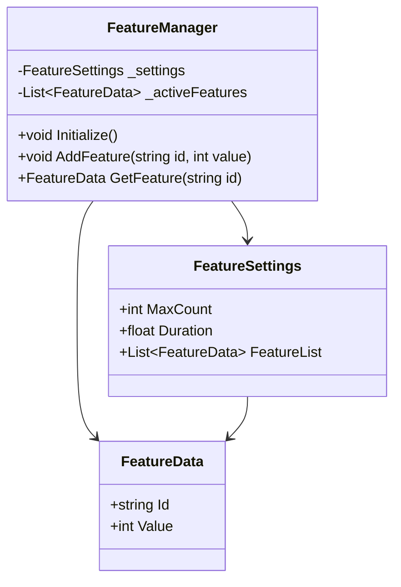
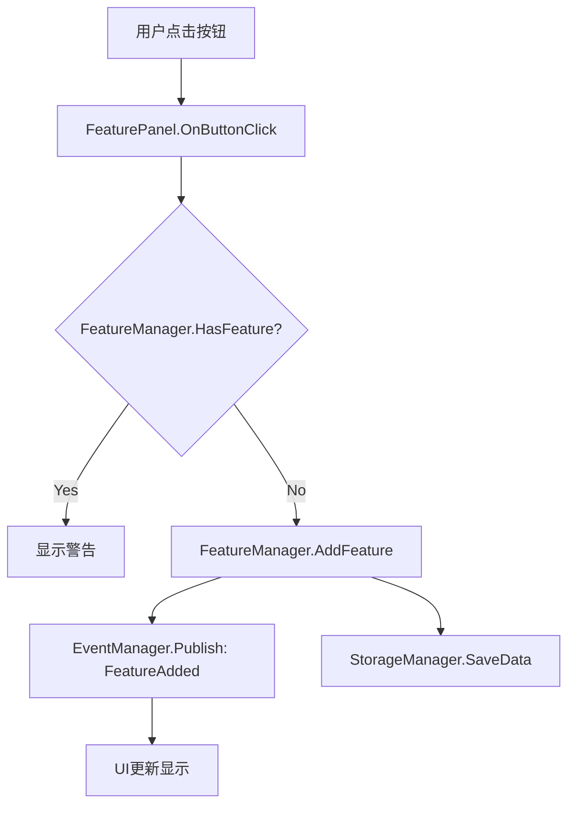

# Phase 1: 架构设计

## 阶段目标

设计系统架构、数据结构、接口规范和调用流程，输出架构设计文档。

## 必须使用的Agent

**unity-architect** - 架构设计专家

调用方式：
```
"请使用 unity-architect 代理设计这个功能的架构"
```

## 必须完成的任务

### 1. 设计数据结构

**ScriptableObject配置**：
```csharp
// 示例：功能配置
[CreateAssetMenu(fileName = "FeatureSettings", menuName = "Settings/Feature Settings")]
public class FeatureSettings : SingletonScriptableSettings<FeatureSettings>
{
    [Header("基础配置")]
    public int MaxCount;
    public float Duration;

    [Header("高级配置")]
    public bool EnableDebug;
    public List<FeatureData> FeatureList;
}

// 数据类
[System.Serializable]
public class FeatureData
{
    public string Id;
    public int Value;
}
```

**Manager状态管理**：
```csharp
// 判断是否需要跨场景
// 如果是：继承SingletonBehaviour + DontDestroyOnSceneChange = true
// 如果否：场景级别单例

public class FeatureManager : SingletonBehaviour<FeatureManager>
{
    protected override bool DontDestroyOnSceneChange => true;
    protected override int InitializationOrder => 20;

    // 私有字段
    private FeatureSettings _settings;
    private List<FeatureData> _activeFeatures;

    // 公共API
    public void Initialize() { }
    public void AddFeature(string id) { }
    public FeatureData GetFeature(string id) { }
}
```

### 2. 设计接口和调用流程

**确定接口**：
- 公共API：供外部调用的方法
- 内部方法：私有的辅助方法
- 事件通知：需要发布哪些事件

**示例**：
```csharp
// 公共API
public class FeatureManager : SingletonBehaviour<FeatureManager>
{
    // 初始化
    public void Initialize() { }

    // 功能操作
    public void AddFeature(string id, int value) { }
    public void RemoveFeature(string id) { }
    public FeatureData GetFeature(string id) { }
    public List<FeatureData> GetAllFeatures() { }

    // 查询
    public bool HasFeature(string id) { }
    public int GetFeatureCount() { }

    // 事件
    public event Action<FeatureData> OnFeatureAdded;
    public event Action<string> OnFeatureRemoved;
}
```

**调用流程图**（使用Mermaid或ASCII）：
```
用户操作
  ↓
UI层（MonoBehaviour）
  ↓
Manager层（FeatureManager）
  ↓
数据层（FeatureData）
  ↓
存储层（StorageManager）
```

### 3. 绘制架构图

**系统架构图**：
```
┌─────────────────────────────────────┐
│         UI Layer (Scene)            │
│  FeaturePanel, FeatureButton        │
└────────────┬────────────────────────┘
             │
┌────────────▼────────────────────────┐
│       Manager Layer (Global)        │
│  FeatureManager (Singleton)         │
└────────────┬────────────────────────┘
             │
┌────────────▼────────────────────────┐
│       Data Layer                    │
│  FeatureSettings (ScriptableObject) │
│  FeatureData (Serializable)         │
└────────────┬────────────────────────┘
             │
┌────────────▼────────────────────────┐
│       Storage Layer                 │
│  StorageManager                     │
└─────────────────────────────────────┘
```

**模块交互图**：
```
FeatureManager ──────> StorageManager (保存数据)
FeatureManager ──────> EventManager (发布事件)
FeatureManager <────── UI (接收操作)
FeatureManager ──────> UI (通知更新)
```

### 4. 确定依赖关系

**Manager依赖**：
- 依赖哪些Manager？（如StorageManager、EventManager）
- 初始化顺序是什么？（InitializationOrder）
- 生命周期如何管理？（DontDestroyOnSceneChange）

**示例**：
```csharp
public class FeatureManager : SingletonBehaviour<FeatureManager>
{
    protected override int InitializationOrder => 20;
    // 20 > StorageManager(0), CurrencyManager(10)
    // 确保依赖的Manager先初始化

    protected override void Awake()
    {
        base.Awake();
        // 不在Awake中访问其他单例
    }

    private void Start()
    {
        // 在Start中安全访问依赖
        var storageManager = StorageManager.Instance;
        if (storageManager != null)
        {
            LoadData();
        }
    }
}
```

### 5. 定义配置系统

**配置文件位置**：
- ScriptableObject文件：`/Assets/BlockPuzzleGameToolkit/Resources/Settings/FeatureSettings.asset`
- 配置脚本：`/Assets/BlockPuzzleGameToolkit/Scripts/Settings/FeatureSettings.cs`

**配置访问**：
```csharp
// 在Manager中访问配置
private void Initialize()
{
    var settings = FeatureSettings.Instance;
    if (settings != null)
    {
        _maxCount = settings.MaxCount;
        _duration = settings.Duration;
    }
    else
    {
        Debug.LogError("FeatureSettings配置文件不存在");
    }
}
```

## 输出物

### 1. 架构设计文档

**文档结构**：
```markdown
# [功能名称] 架构设计

## 1. 概述
- 功能描述
- 设计目标
- 技术选型

## 2. 数据结构
- ScriptableObject配置
- Manager状态数据
- 数据类定义

## 3. 接口设计
- 公共API列表
- 方法签名和说明
- 事件定义

## 4. 架构图
- 系统架构图
- 模块交互图
- 调用流程图

## 5. 依赖关系
- Manager依赖
- 初始化顺序
- 生命周期管理

## 6. 配置系统
- 配置文件路径
- 配置字段说明
- 配置访问方式

## 7. 实现计划
- 文件列表
- 开发顺序
- 预估工作量
```

### 2. 类图（可选）

使用Mermaid格式：


### 3. 流程图（可选）



## 设计原则

### 1. 单一职责原则
- 每个Manager只负责一个功能领域
- 不要把多个功能塞进一个Manager

### 2. 依赖倒置原则
- 依赖接口而非具体实现
- Manager之间通过事件解耦

### 3. 开闭原则
- 对扩展开放，对修改关闭
- 使用配置而非硬编码

### 4. 向后兼容
- 新功能不能破坏现有功能
- 考虑数据迁移和兼容性

## 常见错误

### ❌ 错误1：设计过于复杂

**症状**：
- 过多的抽象层次
- 过度设计模式
- 复杂的继承关系

**解决**：
- 优先使用简单直接的设计
- 只在必要时使用设计模式
- 遵循项目现有架构风格

### ❌ 错误2：忽略依赖关系

**症状**：
- 循环依赖
- 初始化顺序问题
- 生命周期冲突

**解决**：
- 明确Manager之间的依赖
- 使用InitializationOrder控制顺序
- 通过事件解耦强依赖

### ❌ 错误3：没有考虑扩展性

**症状**：
- 硬编码配置
- 固定的枚举值
- 无法动态添加功能

**解决**：
- 使用ScriptableObject配置
- 使用List/Dictionary存储动态数据
- 预留扩展接口

### ❌ 错误4：不遵循现有架构

**症状**：
- 创建新的单例模式
- 不使用项目的Manager系统
- 自己实现存储逻辑

**解决**：
- 使用SingletonBehaviour
- 使用StorageManager保存数据
- 使用EventManager发布事件

## 设计检查清单

完成设计后使用此清单验证：

- [ ] 数据结构完整（ScriptableObject + Manager + Data类）
- [ ] 接口清晰（公共API明确定义）
- [ ] 架构图完整（系统架构 + 模块交互）
- [ ] 依赖关系明确（Manager依赖 + 初始化顺序）
- [ ] 配置系统设计（配置文件 + 访问方式）
- [ ] 单例类型正确（跨场景 vs 场景级别）
- [ ] 遵循现有架构（SingletonBehaviour + Manager系统）
- [ ] 考虑向后兼容（不破坏现有功能）
- [ ] 考虑扩展性（可配置 + 可扩展）
- [ ] 输出架构设计文档

## 下一步

完成架构设计后：
1. 如果是复杂功能，进入 **Phase 1.25: 设计质询**
2. 如果是简单功能，直接进入 **Phase 1.5: 效果确认**
